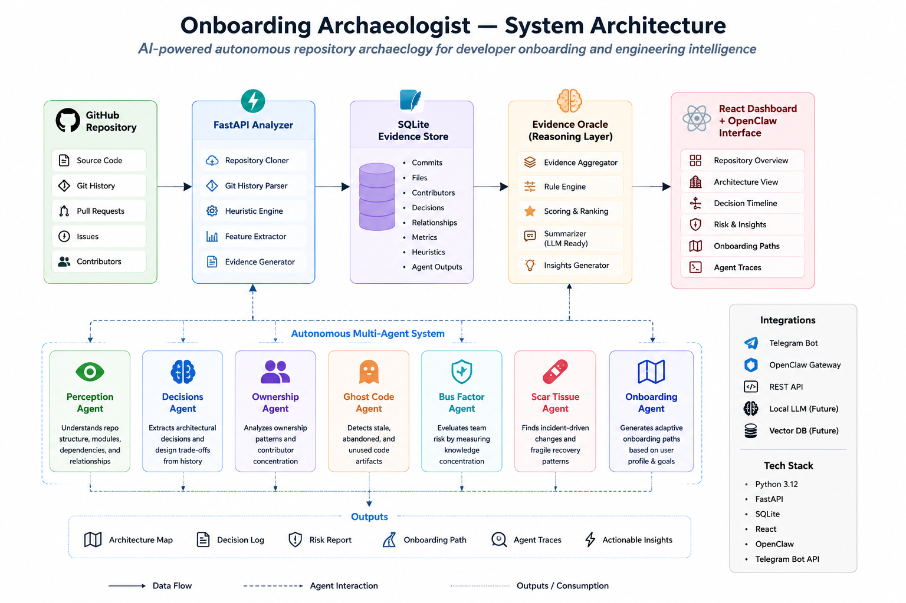

# 🏺 Onboarding Archaeologist — OpenClaw Edition

> AI-powered autonomous repository archaeology for faster developer onboarding, architectural understanding, and engineering intelligence.

<div align="center">


</div>

---

# 🚀 Problem Statement

Modern repositories are becoming increasingly difficult to understand.

New contributors often struggle with:

* Hidden architectural decisions
* Poor onboarding documentation
* Knowledge silos
* Ghost/stale code
* Bus-factor risks
* Understanding ownership patterns
* Incident-generated “scar tissue”

Traditional documentation becomes outdated quickly.

**Onboarding Archaeologist** solves this using autonomous AI agents that actively analyze repositories and generate contextual engineering intelligence in real time.

---

# ✨ What Makes This Different

Unlike traditional documentation tools, Onboarding Archaeologist behaves like an autonomous engineering intelligence system.

It doesn’t just summarize repositories.

It:

* reasons about architecture
* evaluates engineering risks
* generates onboarding journeys
* tracks ownership concentration
* detects ghost code
* exposes technical debt
* provides explainable decision traces

---

# 🧠 Multi-Agent Architecture

The system consists of 7 specialized autonomous agents:

| Agent         | Responsibility                                        |
| ------------- | ----------------------------------------------------- |
| `perception`  | Understands repository structure and architecture     |
| `decisions`   | Identifies architectural decisions and tradeoffs      |
| `ownership`   | Detects contributor concentration and ownership risks |
| `ghost_code`  | Finds stale, abandoned, or unused code                |
| `bus_factor`  | Evaluates dependency on individual contributors       |
| `scar_tissue` | Detects fragile incident-driven code patterns         |
| `onboarding`  | Generates adaptive onboarding paths                   |

---

# 🏗️ Architecture

<div align="center">



</div>

### Architecture Flow

```text
GitHub Repository
        ↓
FastAPI Analyzer
        ↓
SQLite Evidence Store
        ↓
Evidence Oracle
        ↓
React Dashboard + OpenClaw Interface
```

The MVP intentionally uses deterministic git-history heuristics first.  
The next evolution introduces local LLM-based evidence summarization and ranking for deeper architectural intelligence.

---

# ⚡ Features

## 🔍 Autonomous Repository Analysis

Analyze repositories using coordinated multi-agent reasoning.

## 🧭 Adaptive Onboarding

Generate personalized onboarding journeys based on:

* experience level
* repository complexity
* learning time budget

## 🧠 Architectural Intelligence

Automatically extract:

* architectural decisions
* dependency relationships
* engineering risks
* design patterns

## 👻 Ghost Code Detection

Identify:

* stale files
* dead modules
* abandoned features
* unused logic

## 🧬 Explainable AI

Every agent exposes:

* reasoning traces
* execution history
* transparent decision making

## 🤖 OpenClaw + Telegram Integration

Interact with the system directly through Telegram commands.

---

# 🛠️ Tech Stack

## Backend

* Python 3.12
* FastAPI
* Uvicorn
* AsyncIO

## Agent Orchestration

* OpenClaw
* Autonomous multi-agent execution
* Tool-driven reasoning

## Integrations

* Telegram Bot API
* GitHub Repository Analysis
* REST APIs

## Infrastructure

* SQLite Evidence Store
* Real-time agent tracing
* Modular skill architecture
* React Dashboard

---

# 📂 API Endpoints

## Health Check

```bash
curl http://localhost:8000/health
```

---

## Agent Status

```bash
curl http://localhost:8000/api/v2/agent-status
```

---

## Autonomous Repository Analysis

```bash
curl -X POST \
"http://localhost:8000/api/v2/analyze-autonomous?owner=openclaw&repo=openclaw"
```

---

## Agent Decision Trace

```bash
curl http://localhost:8000/api/v2/agent-decision-trace/perception
```

---

# 📱 Telegram Commands

| Command                          | Description                           |
| -------------------------------- | ------------------------------------- |
| `/agent-status`                  | View operational status of all agents |
| `/agent-trace perception`        | Inspect reasoning traces              |
| `/analyze-autonomous owner/repo` | Run repository analysis               |
| `/onboarding junior 40`          | Generate onboarding path              |
| `/agent-feedback`                | Submit adaptive feedback              |

---

# ⚙️ Installation

## Clone Repository

```bash
git clone https://github.com/Sanjeev864/Onboarding-Archeologist---Openclaw-.git

cd Onboarding-Archeologist---Openclaw-
```

---

## Setup Environment

```bash
cp .env.example .env
```

Configure:

```env
TELEGRAM_BOT_TOKEN=YOUR_TOKEN
ARCHAEOLOGIST_API_URL=http://localhost:8000
BACKEND_URL=http://localhost:8000
```

---

## Install Dependencies

```bash
python3.12 -m venv .venv

source .venv/bin/activate

pip install -r backend/requirements.txt
```

---

## Start Backend

```bash
uvicorn backend.app.main:app --host 0.0.0.0 --port 8000 --reload
```

---

## Start OpenClaw Gateway

```bash
openclaw gateway run --force
```

---

# 📊 Example Use Cases

## 🚀 New Developer Onboarding

Generate structured onboarding paths for junior engineers.

## 🏢 Enterprise Repository Intelligence

Analyze repositories for maintainability and ownership risks.

## 🧠 Engineering Leadership

Identify architectural debt and organizational bottlenecks.

## 🔥 Incident Recovery Analysis

Understand fragile recovery patterns and technical “scar tissue”.

## 👥 Team Bus Factor Analysis

Detect over-dependence on individual contributors.

---

# 🔮 Future Scope

* RAG-powered repository memory
* IDE integrations
* Autonomous remediation suggestions
* Multi-repository intelligence graphs
* Real-time engineering observability dashboards
* Vectorized architectural search

---

# 🧪 Project Highlights

✅ Autonomous Multi-Agent Intelligence
✅ Explainable AI Decision Tracing
✅ Telegram-Based Engineering Assistant
✅ Real-Time Repository Analysis
✅ OpenClaw Skill Integration
✅ Adaptive Developer Onboarding

---

# 👨‍💻 Team

Built for next-generation developer intelligence and autonomous onboarding workflows.

---

# 📜 License

MIT License

---

<div align="center">

## 🏺 “Every repository has history.

Onboarding Archaeologist uncovers it.”

</div>
