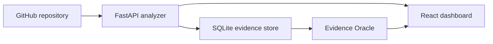

# Onboarding Archaeologist

AI-powered codebase intelligence that reconstructs decisions, identifies ghost-code candidates, maps knowledge ownership, and answers onboarding questions with evidence from git history.

## Quick Start

```bash
cp .env.example .env
# add GITHUB_TOKEN if you want private repo access
docker-compose up -d --build
```

Open:

- Frontend: http://localhost:3000
- API docs: http://localhost:8000/docs

LLM enrichment uses a free local Ollama model by default when enabled. Ollama is
behind the `llm` Compose profile because the image is large:

```bash
docker-compose --profile llm up -d ollama
docker exec archaeologist-ollama ollama pull llama3:latest
```

## What Works

- Analyze a GitHub repository from the UI.
- Mine the latest 200 commits for architectural decision signals.
- Detect ownership concentration and bus-factor risk by source path.
- Flag ghost-code candidates using staleness and legacy/deprecated markers.
- Ask the Oracle questions about decisions, owners, or dead-code candidates.
- Store analysis results in local SQLite under `data/`.

## Configuration

Copy `.env.example` to `.env` and adjust values:

```bash
GITHUB_TOKEN=your_github_token_here
ENABLE_LLM_ANALYSIS=false
LLM_PROVIDER=ollama
LLM_MODEL=llama3:latest
DATABASE_URL=sqlite:///./data/archaeologist.db
VITE_API_URL=http://localhost:8000
```

Public repositories can be analyzed without a token. Private repositories require a token with repository read access.
Claude/Anthropic is optional and only used when `LLM_PROVIDER=anthropic`.

## OpenClaw Integration

The repository includes a local OpenClaw skill in `openclaw/skills/archaeologist`.
OpenClaw is the automation layer; Telegram support comes from running OpenClaw
Gateway with a Telegram bot token and this skill enabled.

Install it with:

```powershell
.\scripts\install-openclaw-skill.ps1
```

See `docs/OPENCLAW_INTEGRATION.md` for setup, commands, and API smoke tests.

## Development

Backend:

```bash
pip install -r backend/requirements.txt
uvicorn backend.app.main:app --reload
```

Frontend:

```bash
cd frontend
npm install
npm run dev
```

## Architecture



The MVP intentionally uses deterministic git-history heuristics first. Ollama configuration is present for the next step: summarizing and ranking evidence with a local LLM
